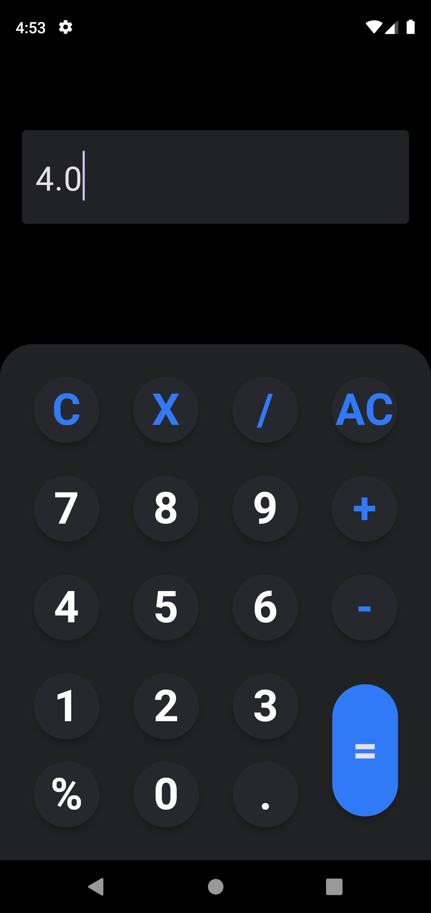
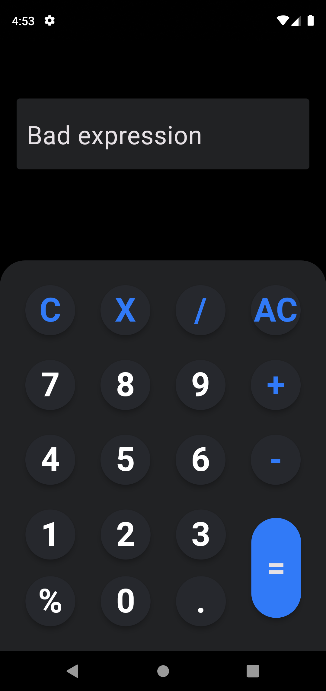

# Flutter Calculator App

This Flutter Calculator App is a simple yet powerful calculator application built using the Flutter framework. It provides basic arithmetic operations such as addition, subtraction, multiplication, and division, along with other useful features.


## Features

```
Basic Arithmetic Operations: Perform addition, subtraction, multiplication, and division with ease.
Clear and Simple Interface: Intuitive user interface for easy navigation and operation.
History: View a history of your calculations for reference.
Theme Options: Choose from different themes to personalize your calculator experience.
Error Handling: Handle errors gracefully and provide helpful messages for users.
```

## Screenshots



## Getting Started
[Tap here](https://drive.google.com/drive/folders/1urcN8kRq_bvLil7yFdkc5zSrizt8PNPc?usp=sharing) to download the app and enjoy! 